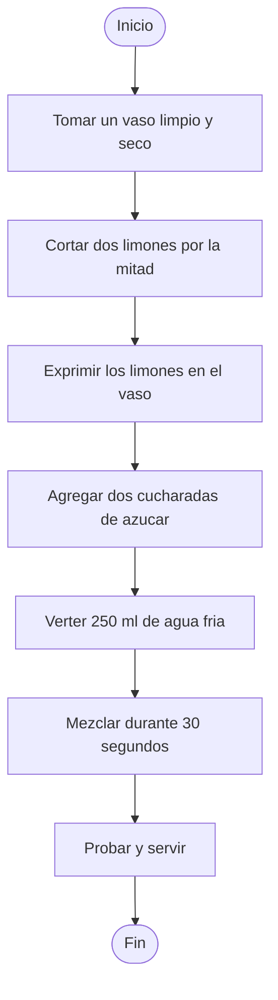

# Diagrama de flujo: preparar limonada

```mermaid
flowchart TD
    A([Inicio]) --> B[Tomar un vaso limpio y seco]
    B --> C[Cortar dos limones por la mitad]
    C --> D[Exprimir los limones en el vaso]
    D --> E[Agregar dos cucharadas de azucar]
    E --> F[Verter 250 ml de agua fria]
    F --> G[Mezclar durante 30 segundos]
    G --> H[Probar y servir]
    H --> I([Fin])
```
