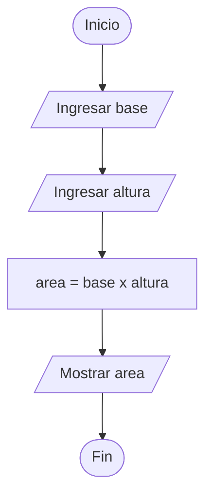

# Diagrama de flujo: area de un rectangulo

```mermaid
flowchart TD
    A([Inicio]) --> B[/Ingresar base/]
    B --> C[/Ingresar altura/]
    C --> D[area = base x altura]
    D --> E[/Mostrar area/]
    E --> F([Fin])
```
