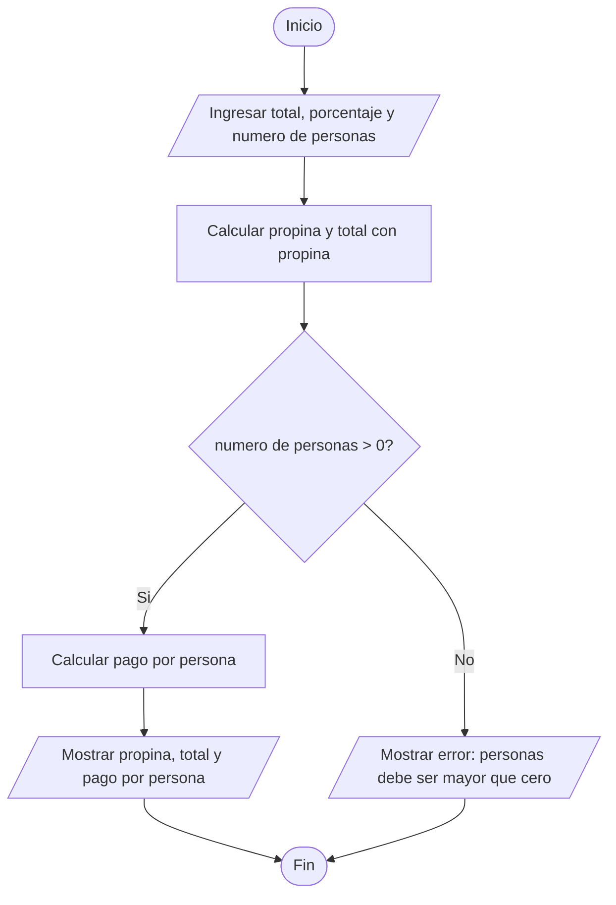

# Diagrama de flujo: calcular propina y dividir la cuenta

```mermaid
flowchart TD
    A([Inicio]) --> B[/Ingresar total, porcentaje y numero de personas/]
    B --> C[Calcular propina y total con propina]
    C --> D{numero de personas > 0?}
    D -- Si --> E[Calcular pago por persona]
    E --> F[/Mostrar propina, total y pago por persona/]
    D -- No --> G[/Mostrar error: personas debe ser mayor que cero/]
    F --> H([Fin])
    G --> H
```
