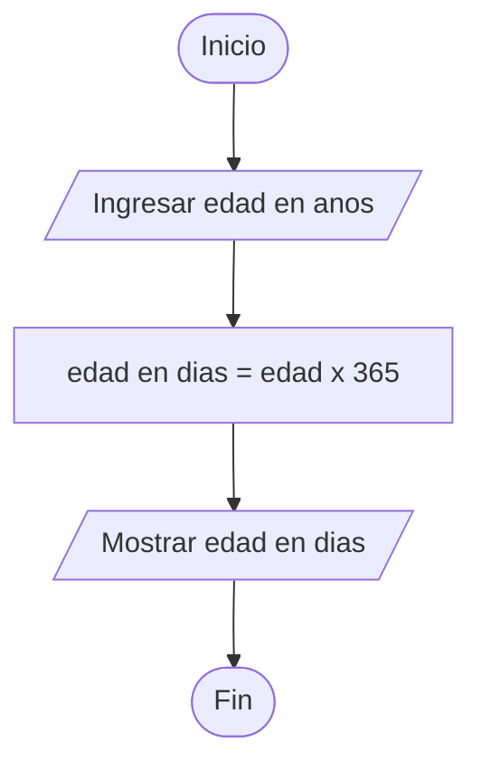

# Diagrama de flujo: edad en dias

```mermaid
flowchart TD
    A([Inicio]) --> B[/Ingresar edad en anos/]
    B --> C[edad en dias = edad x 365]
    C --> D[/Mostrar edad en dias/]
    D --> E([Fin])
```
