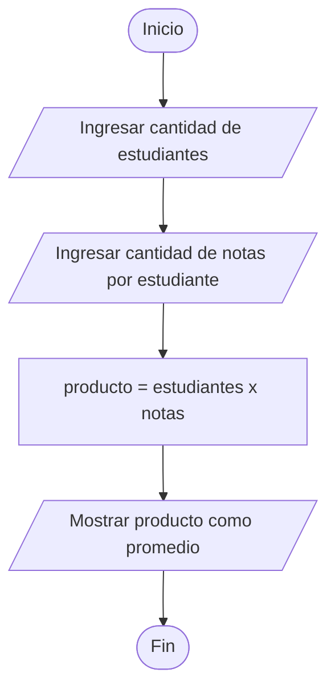

# Diagrama de flujo: producto de estudiantes y notas

```mermaid
flowchart TD
    A([Inicio]) --> B[/Ingresar cantidad de estudiantes/]
    B --> C[/Ingresar cantidad de notas por estudiante/]
    C --> D[producto = estudiantes x notas]
    D --> E[/Mostrar producto como promedio/]
    E --> F([Fin])
```
