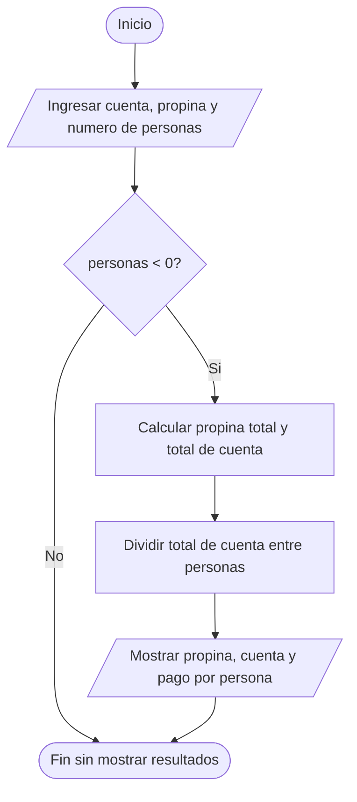

# Diagrama de flujo: calculadora de propinas

```mermaid
flowchart TD
    A([Inicio]) --> B[/Ingresar cuenta, propina y numero de personas/]
    B --> C{personas < 0?}
    C -- Si --> D[Calcular propina total y total de cuenta]
    D --> E[Dividir total de cuenta entre personas]
    E --> F[/Mostrar propina, cuenta y pago por persona/]
    C -- No --> G([Fin sin mostrar resultados])
    F --> G
```
