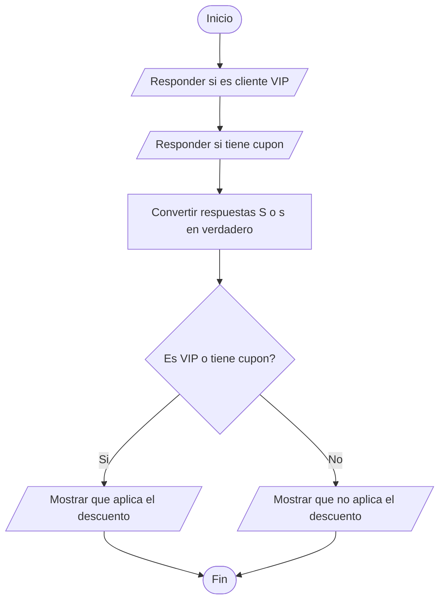

# Diagrama de flujo: reglas de descuento

```mermaid
flowchart TD
    A([Inicio]) --> B[/Responder si es cliente VIP/]
    B --> C[/Responder si tiene cupon/]
    C --> D[Convertir respuestas S o s en verdadero]
    D --> E{Es VIP o tiene cupon?}
    E -- Si --> F[/Mostrar que aplica el descuento/]
    E -- No --> G[/Mostrar que no aplica el descuento/]
    F --> H([Fin])
    G --> H
```
