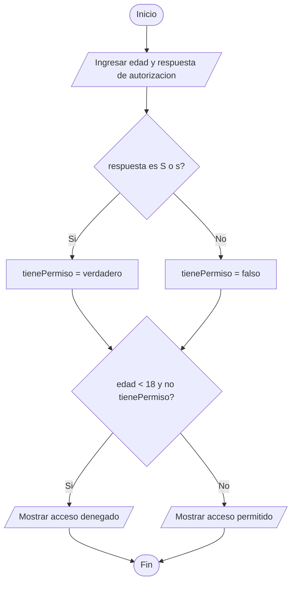

# Diagrama de flujo: validacion de acceso con De Morgan

```mermaid
flowchart TD
    A([Inicio]) --> B[/Ingresar edad y respuesta de autorizacion/]
    B --> C{respuesta es S o s?}
    C -- Si --> D[tienePermiso = verdadero]
    C -- No --> E[tienePermiso = falso]
    D --> F{edad < 18 y no tienePermiso?}
    E --> F
    F -- Si --> G[/Mostrar acceso denegado/]
    F -- No --> H[/Mostrar acceso permitido/]
    G --> I([Fin])
    H --> I
```
