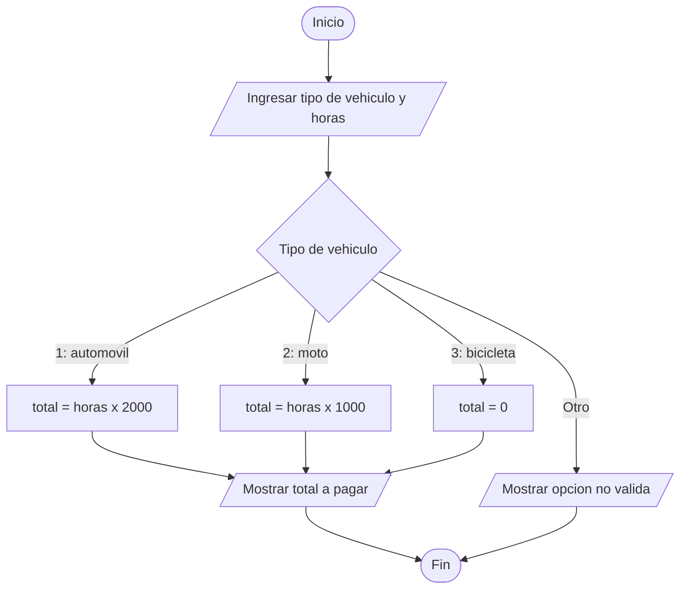

# Diagrama de flujo: tarifas del parqueadero

```mermaid
flowchart TD
    A([Inicio]) --> B[/Ingresar tipo de vehiculo y horas/]
    B --> C{Tipo de vehiculo}
    C -- 1: automovil --> D[total = horas x 2000]
    C -- 2: moto --> E[total = horas x 1000]
    C -- 3: bicicleta --> F[total = 0]
    C -- Otro --> G[/Mostrar opcion no valida/]
    D --> H[/Mostrar total a pagar/]
    E --> H
    F --> H
    H --> I([Fin])
    G --> I
```
