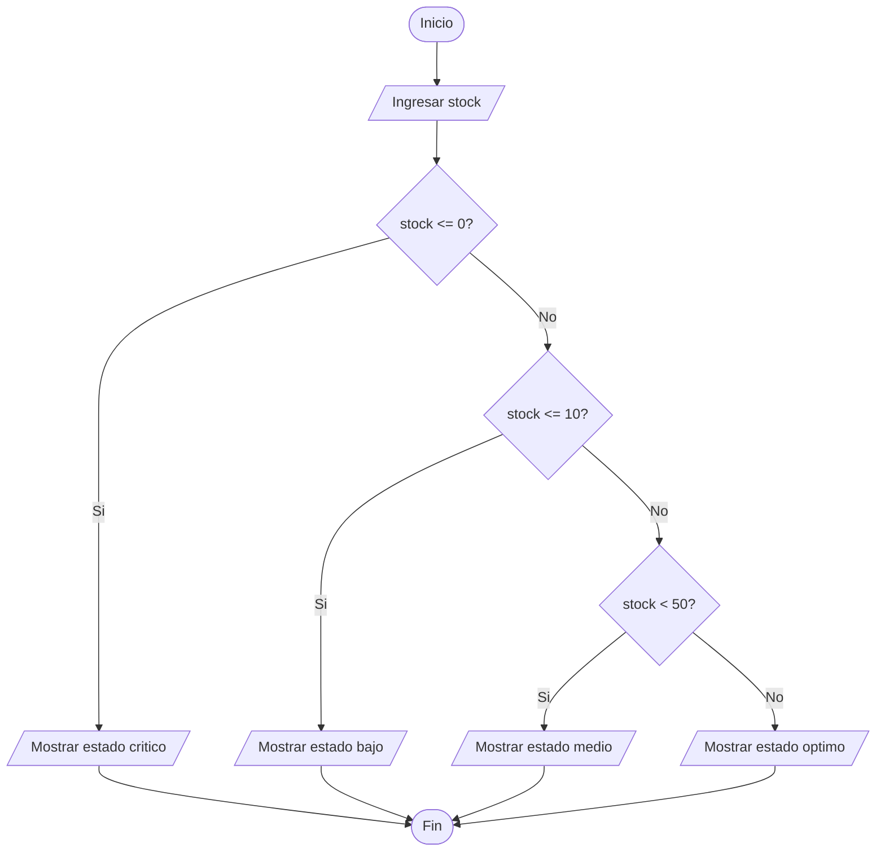

# Diagrama de flujo: semaforo de inventario

```mermaid
flowchart TD
    A([Inicio]) --> B[/Ingresar stock/]
    B --> C{stock <= 0?}
    C -- Si --> D[/Mostrar estado critico/]
    C -- No --> E{stock <= 10?}
    E -- Si --> F[/Mostrar estado bajo/]
    E -- No --> G{stock < 50?}
    G -- Si --> H[/Mostrar estado medio/]
    G -- No --> I[/Mostrar estado optimo/]
    D --> J([Fin])
    F --> J
    H --> J
    I --> J
```
