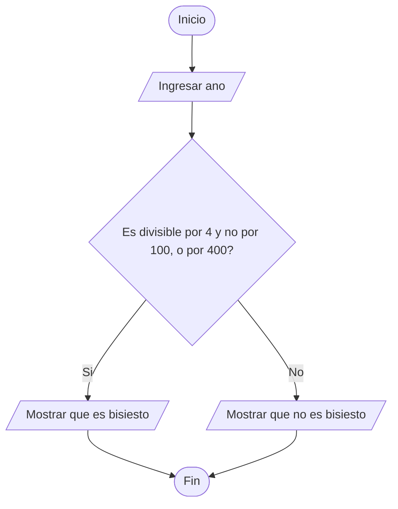

# Diagrama de flujo: ano bisiesto

```mermaid
flowchart TD
    A([Inicio]) --> B[/Ingresar ano/]
    B --> C{Es divisible por 4 y no por 100, o por 400?}
    C -- Si --> D[/Mostrar que es bisiesto/]
    C -- No --> E[/Mostrar que no es bisiesto/]
    D --> F([Fin])
    E --> F
```
