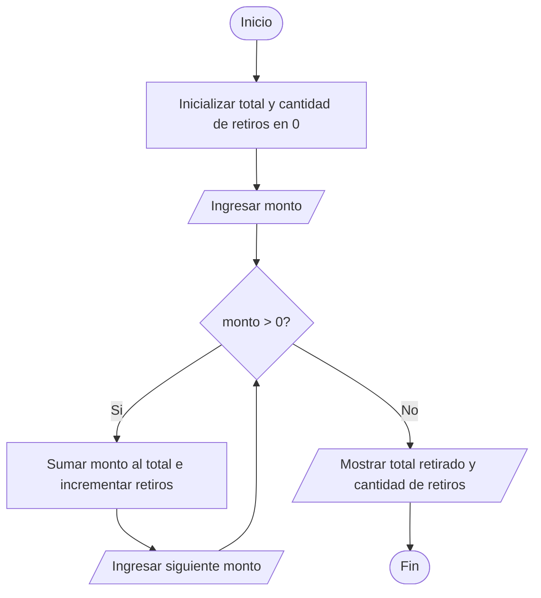

# Diagrama de flujo: simular un cajero

```mermaid
flowchart TD
    A([Inicio]) --> B[Inicializar total y cantidad de retiros en 0]
    B --> C[/Ingresar monto/]
    C --> D{monto > 0?}
    D -- Si --> E[Sumar monto al total e incrementar retiros]
    E --> F[/Ingresar siguiente monto/]
    F --> D
    D -- No --> G[/Mostrar total retirado y cantidad de retiros/]
    G --> H([Fin])
```
