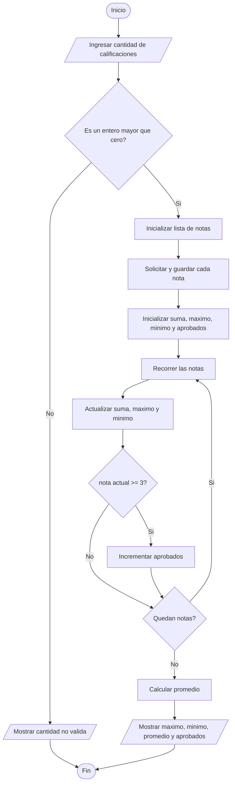

# Diagrama de flujo: analizar calificaciones

```mermaid
flowchart TD
    A([Inicio]) --> B[/Ingresar cantidad de calificaciones/]
    B --> C{Es un entero mayor que cero?}
    C -- No --> D[/Mostrar cantidad no valida/]
    D --> Z([Fin])
    C -- Si --> E[Inicializar lista de notas]
    E --> F[Solicitar y guardar cada nota]
    F --> G[Inicializar suma, maximo, minimo y aprobados]
    G --> H[Recorrer las notas]
    H --> I[Actualizar suma, maximo y minimo]
    I --> J{nota actual >= 3?}
    J -- Si --> K[Incrementar aprobados]
    J -- No --> L{Quedan notas?}
    K --> L
    L -- Si --> H
    L -- No --> M[Calcular promedio]
    M --> N[/Mostrar maximo, minimo, promedio y aprobados/]
    N --> Z
```
