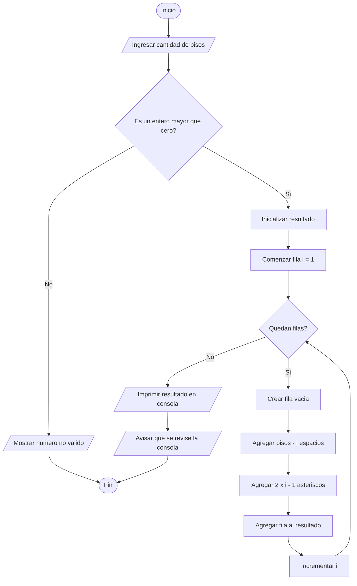

# Diagrama de flujo: generar una piramide de asteriscos

```mermaid
flowchart TD
    A([Inicio]) --> B[/Ingresar cantidad de pisos/]
    B --> C{Es un entero mayor que cero?}
    C -- No --> D[/Mostrar numero no valido/]
    D --> Z([Fin])
    C -- Si --> E[Inicializar resultado]
    E --> F[Comenzar fila i = 1]
    F --> G{Quedan filas?}
    G -- Si --> H[Crear fila vacia]
    H --> I[Agregar pisos - i espacios]
    I --> J[Agregar 2 x i - 1 asteriscos]
    J --> K[Agregar fila al resultado]
    K --> L[Incrementar i]
    L --> G
    G -- No --> M[/Imprimir resultado en consola/]
    M --> N[/Avisar que se revise la consola/]
    N --> Z
```
