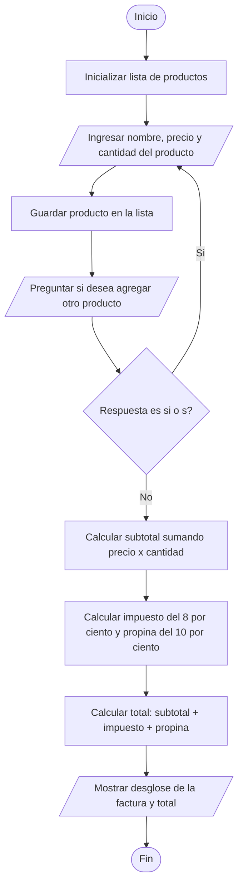

# Diagrama de flujo: calcular una factura de consumo

```mermaid
flowchart TD
    A([Inicio]) --> B[Inicializar lista de productos]
    B --> C[/Ingresar nombre, precio y cantidad del producto/]
    C --> D[Guardar producto en la lista]
    D --> E[/Preguntar si desea agregar otro producto/]
    E --> F{Respuesta es si o s?}
    F -- Si --> C
    F -- No --> G[Calcular subtotal sumando precio x cantidad]
    G --> H[Calcular impuesto del 8 por ciento y propina del 10 por ciento]
    H --> I[Calcular total: subtotal + impuesto + propina]
    I --> J[/Mostrar desglose de la factura y total/]
    J --> K([Fin])
```
